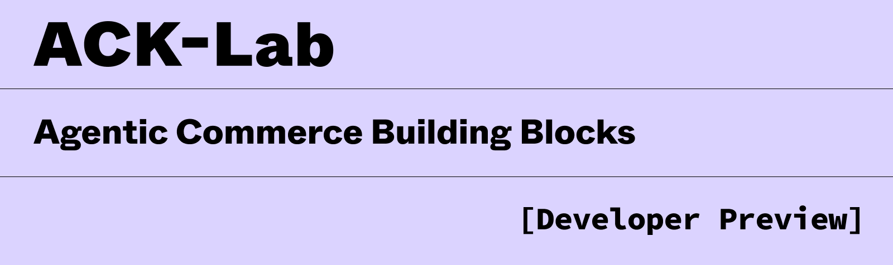
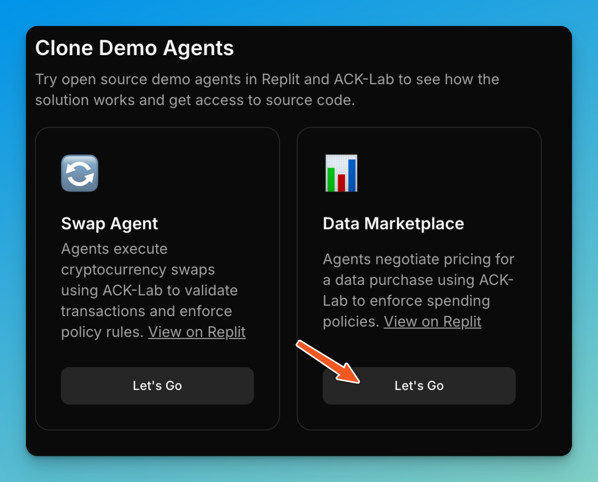
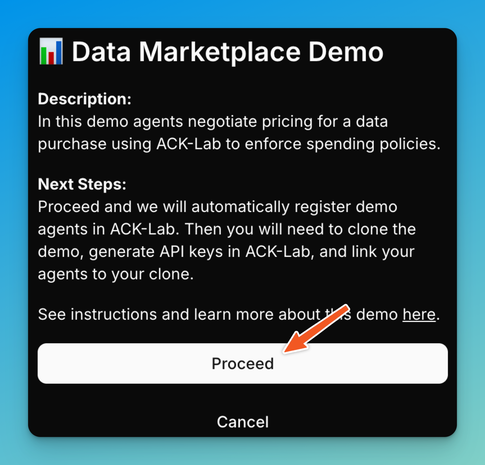
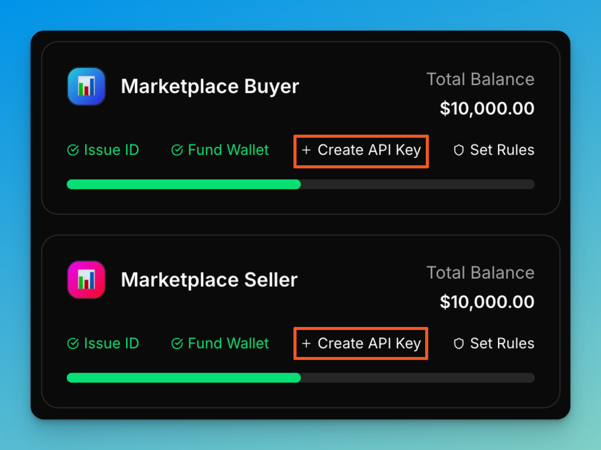
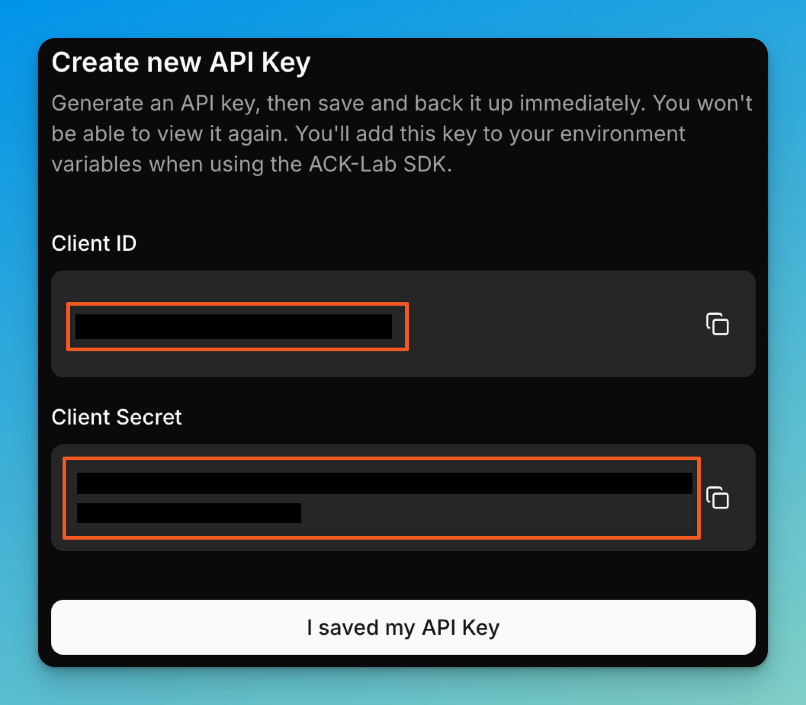
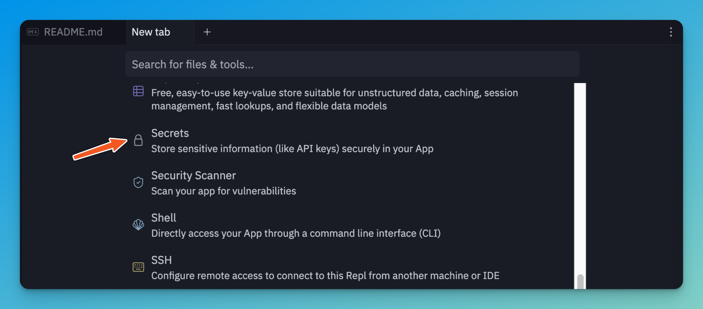
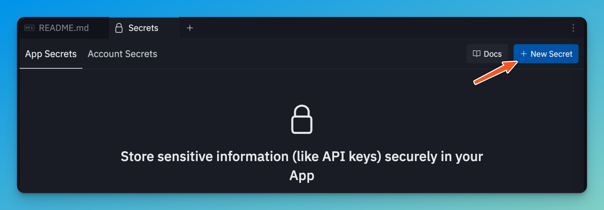
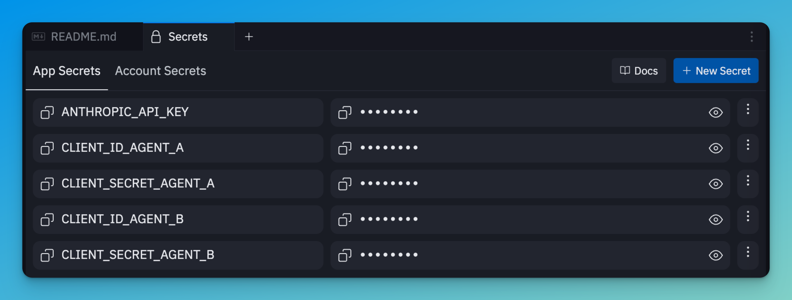

# ACK Data Marketplace Demo



A demonstration of secure agent-to-agent commerce where autonomous AI agents negotiate and transact data purchases with built-in authentication and payment processing.

> ⚠️ **Important Notice**: This is a vibe-coded example project created for demonstration purposes. Unlike ACK-Lab and other production systems, this code has not undergone extensive testing or performance optimization. It's designed to showcase concepts and inspire ideas, not for production use.

## 🚀 Quick Start

### 1. Run on Replit (Easiest)
If you're on Replit already, proceed to Step 2. If you're on Github, click the button below to clone this repo to Replit.

[](https://replit.new/github.com/catena-labs/ack-lab-demo-data-marketplace)

### 2. Get Your Credentials
1. Get an Anthropic API key from [console.anthropic.com](https://console.anthropic.com) Note: This demo requires `claude-sonnet-4-20250514`. We cannot guarantee it works end-to-end with smaller models from Anthropic or other providers.
2. If you have not done so already, join the ACK-Lab developer preview at [ack-lab.catenalabs.com](https://ack-lab.catenalabs.com).
3. If you have not done so already by cloning the app in ACK-Lab, **register your agents** to obtain credentials.(see [Registering Your Agents on ACK-Lab](#registering-your-agents-on-ack-lab) below).
4. Generate API Keys and copy your credentials (see [Getting Started Guide](#getting-started-guide))

### 3. Configure & Run
1. Click "Run" on Replit (or run `npm run dev` locally)
2. Start the CLI demo

<div align="center">
  
</div>

## 📊 What This Demo Does

Watch two AI agents negotiate a data marketplace transaction:

- **Marketplace Buyer**: Has a budget and needs data resources
- **Marketplace Seller**: Offers premium datasets at negotiable prices
- **Real Payments**: Agents use ACK-Lab to process actual transactions
- **Secure Communication**: All agent-to-agent messages are authenticated and encrypted

### Available Datasets
1. **US Housing Market Inventory 2024**: $300 (negotiable down to $200)
2. **SPY Ticker Data (365 days)**: $350 (negotiable down to $250)  
3. **LLM Benchmarking Study 2024**: $200 (negotiable down to $150)

### Demo Mode
- **CLI Demo**: Watch agents negotiate in real-time through the terminal

## Getting Started Guide

### Registering Your Agents on ACK-Lab
ACK-Lab makes it easy for you to register demo agents for this flow. 

   **Follow these steps on ACK-Lab to create your agents and get the necessary API keys**. You will need to generate the API keys for your first agent, enter them in Replit Secrets (or .env if running locally), and then do the same for the second agent:
   <div align="center">
      
      
      
      
   </div>

### Configuring Environment Variables
- Use [Replit Secrets](https://docs.replit.com/replit-workspace/workspace-features/secrets). Note that public Replit projects expose all files, including .env files, so **do not use .env files on Replt.** Enter your secret variables through Replit's Secrets tool.   
   - Add your ACK Lab credentials. You can find these ID and SECRET variables in the API KEYS section for each agent.
   ```env
   ANTHROPIC_API_KEY=your_anthropic_key
   CLIENT_ID_MARKETPLACE_BUYER=your_marketplace_buyer_client_id
   CLIENT_SECRET_MARKETPLACE_BUYER=your_marketplace_buyer_client_secret
   CLIENT_ID_MARKETPLACE_SELLER=your_marketplace_seller_client_id
   CLIENT_SECRET_MARKETPLACE_SELLER=your_marketplace_seller_client_secret
   ```
   **Follow these steps on Replit to add your Secrets**:
   <div align="center">
      
      
      
   </div>


## 🏗️ Technical Details

The demo spins up two independent agent servers that communicate via HTTP endpoints:

```
┌─────────────────┐                      ┌─────────────────┐
│ Marketplace     │  HTTP POST /chat     │ Marketplace     │
│    Buyer        │─────────────────────▶│    Seller       │
│                 │◀─────────────────────│                 │
│  Port: 7576     │                       │  Port: 7577     │
└─────────────────┘  Negotiation Flow    └─────────────────┘
        │                                          │
        └──────────────────┬───────────────────────┘
                           │
                    ACK Lab SDK
                 (api.ack-lab.com)
              ┌────────────┴────────────┐
              │ • Identity Verification  │
              │ • Payment Processing     │
              │ • Token Generation       │
              └─────────────────────────┘
```

### Replit Port Configuration
- **Marketplace Buyer**: Internal port 7576 → External port 3000
- **Marketplace Seller**: Internal port 7577 → External port 3001

## 💻 Local Development

### Prerequisites
- Node.js 18+ with npm
- ACK Lab credentials from [ack-lab.catenalabs.com](https://ack-lab.catenalabs.com)

1. **Clone and Configure**
```bash
git clone <repository-url>
cd ack-private-data-marketplace
```

2. **Create `.env` file** with your credentials:
```env
ANTHROPIC_API_KEY=your_anthropic_key
CLIENT_ID_MARKETPLACE_BUYER=your_marketplace_buyer_client_id
CLIENT_SECRET_MARKETPLACE_BUYER=your_marketplace_buyer_client_secret
CLIENT_ID_MARKETPLACE_SELLER=your_marketplace_seller_client_id  
CLIENT_SECRET_MARKETPLACE_SELLER=your_marketplace_seller_client_secret
BUYER_BUDGET=10  # Optional: Set custom budget (default: 10)
```

3. **Run the Setup Script**
```bash
   npm run dev
```

### Local Access Points
- Marketplace Buyer: `http://localhost:7576`
- Marketplace Seller: `http://localhost:7577`

## 🐛 Troubleshooting

- **Missing credentials**: Get them from [ack-lab.catenalabs.com](https://ack-lab.catenalabs.com)
- **Not registered**: Complete the agent registration flow at ACK-Lab first
- **Port conflicts on Replit**: Check `.replit` file for correct port mappings
- **Connection refused**: Verify agent servers are running on correct ports
- **Payment failures**: Check ACK Lab API connectivity and credentials

## 📖 About Agent Commerce Kit (ACK)

[**Agent Commerce Kit (ACK)**](https://agentcommercekit.com) is a set of open-source patterns to enable AI agents to participate securely in commerce. As we advance toward an AI-native financial future, ACK addresses the fundamental challenge that today's financial infrastructure was not designed for intelligent machines.

### What ACK Provides

- **ACK-ID**: Verifiable agent identity through Decentralized Identifiers (DIDs) and Verifiable Credentials (VCs)
- **ACK-Pay**: Agent-native payment patterns for diverse payment rails
- **ACK-Lab**: Developer preview platform providing identity, wallet, and rulebook for agents

ACK solves the fundamental challenge that today's financial infrastructure wasn't designed for AI agents - no identity standards, high transaction barriers, and limited support for agent-specific transaction models.

### Learn More

- [Agent Commerce Kit Documentation](https://agentcommercekit.com)
- [ACK-Lab Developer Preview](https://ack-lab.catenalabs.com)
- [Catena Labs](https://www.catenalabs.com)

## 📄 License

MIT